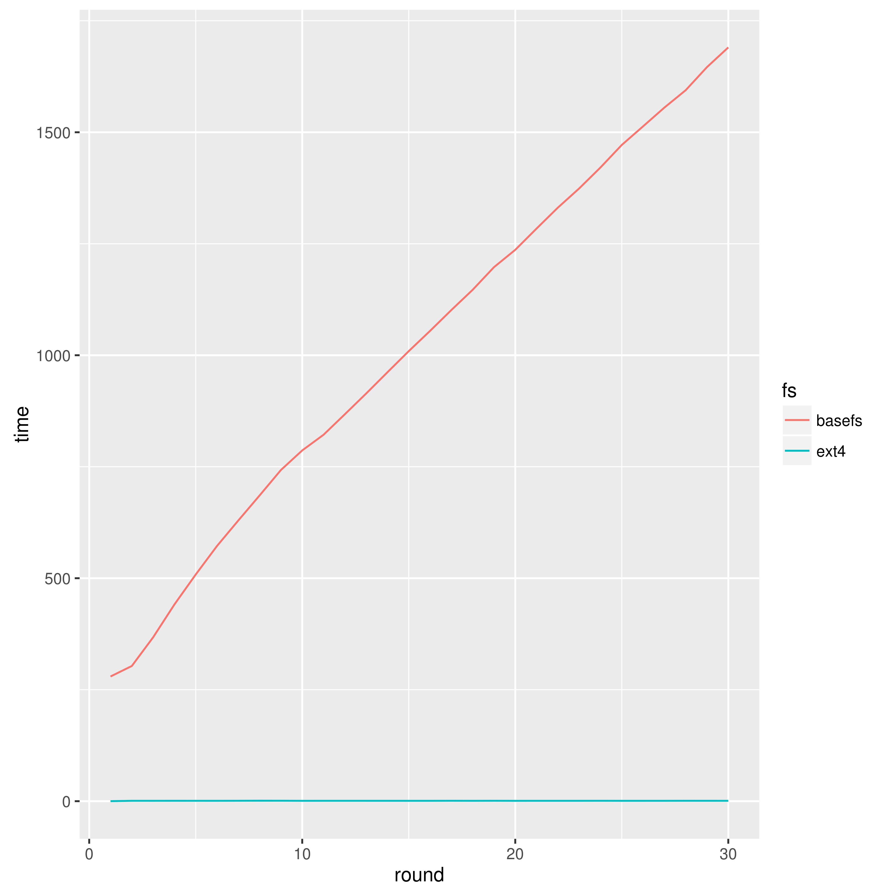
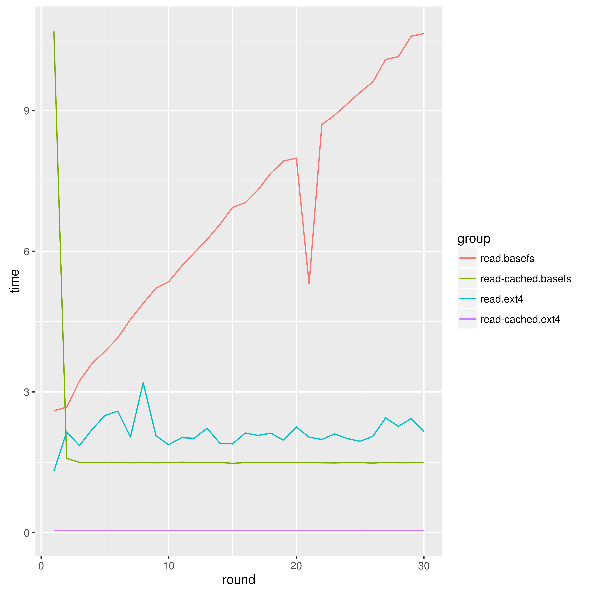

Network Evaluation
=================
We are going to evaluate the convergence properties and traffic usage of the gossip layer and the sync protocol. We define convergence as

1. Convergence of Gossip layer and Sync protocol
    * Convergence time
    * small files vs big files
    * Saturation limit of the gossip layer (number of messages)
    * Convergence under NAT (too complex)


2. Traffic usage of Gossip layer and Sync protocol
    * How much overhead?
    * Is the traffic usage well balance between nodes?
    * Saturation limit of sync protocol (minimum time before adding too much overhead)


In two different environments:

1. Controlled Virtual environment with Docker and TC
    * Each node runs on a Debian 6 Docker container with a virtual ethernet device. Nodes are connected with one level 2 hop between them. This is a controlled environment and we use Linux traffic control to emulate variable delay, packet loos, duplication and re-ordering, in order to understand its effects on BaseFS's communication protocols.

2. Ralistic environment on Confine testbed
    * Each BaseFS node runs on a Debian LXC container on top of a Confine Node. Confine Nodes are heterogeneous devices and resources are share with other ongoing experiments, which makes for a very inconsistent performance characteristics. All nodes are connected using the native IP network provided by different community networks where Confine nodes are deployed. Since we don't have much control of the underlying infraestructure we provide a network characterization to better understand the environment where the experiment is taking place.


File Operations Performance
===========================
Read/write performance compared to traditional filesystems (ext4) [script](docker/performance.sh)

```bash
bash experiment 2
bash performance.sh
```
#### Write performance


#### Read performance



/ETC Characterization
=====================
Is the gossip layer a good transport protocol for configuration replication? Is BaseFS Merkle DAG consensus strategy effective enough for solving configuration conflicts?

1. How many Gossip packets (512b) we will need?
2. How many conflicts can we expect?


NOTES
=====

    tc -s qdisc ls dev eth0

netem provides Network Emulation functionality for testing protocols by emulating the properties of wide area networks.

Delay
-----
Typically, the delay in a network is not uniform. It is more common to use a something like a normal distribution to describe the variation in delay. The netem discipline can take a table to specify a non-uniform distribution.

100ms ± 20ms

Reorder
-------
In this example, 25% of packets (with a correlation of 50%) will get sent immediately, others will be delayed by 10ms.
tc qdisc change dev eth0 root netem delay 10ms reorder 25% 50%

Packet loss
-----------
An optional correlation may also be added. This causes the random number generator to be less random and can be used to emulate packet burst losses.
This will cause 0.3% of packets to be lost, and each successive probability depends by a quarter on the last one.
Probn = .25 * Probn-1 + .75 * Random

Bandwidth
--------
 There is no rate control built-in to the netem discipline, instead use one of the other disciplines that does do rate control. In this example, we use Token Bucket Filter (TBF) to limit output.
 50 packets buffer (seems to be the deafult, 75000bytes, )
 
* burst, also known as buffer or maxburst. Size of the bucket, in bytes. This is the maximum amount of bytes that tokens can be available for instantaneously. In general, larger shaping rates require a larger buffer. For 10mbit/s on Intel, you need at least 10kbyte buffer if you want to reach your configured rate!
 https://en.wikipedia.org/wiki/Token_bucket
* limit or latency Limit is the number of bytes that can be queued waiting for tokens to become available. latency parameter, which specifies the maximum amount of time a packet can sit in the TBF
