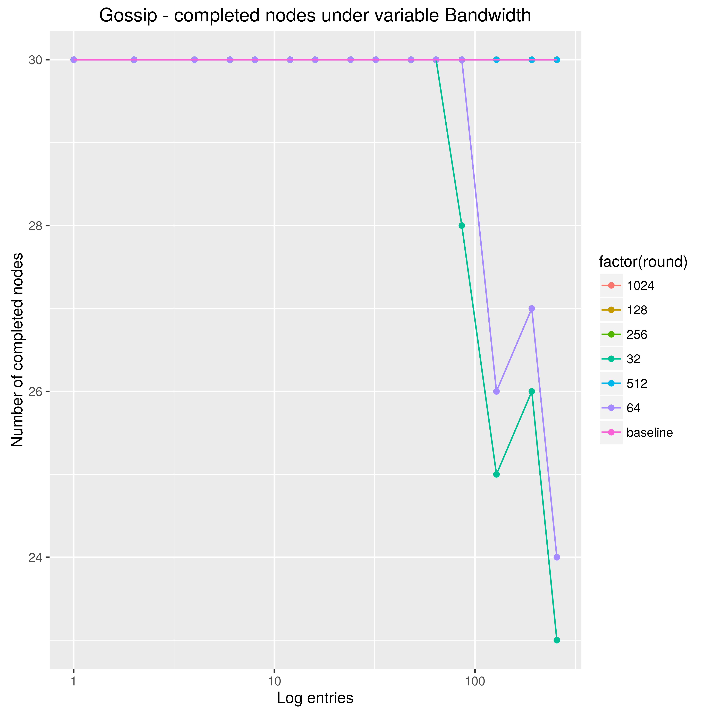
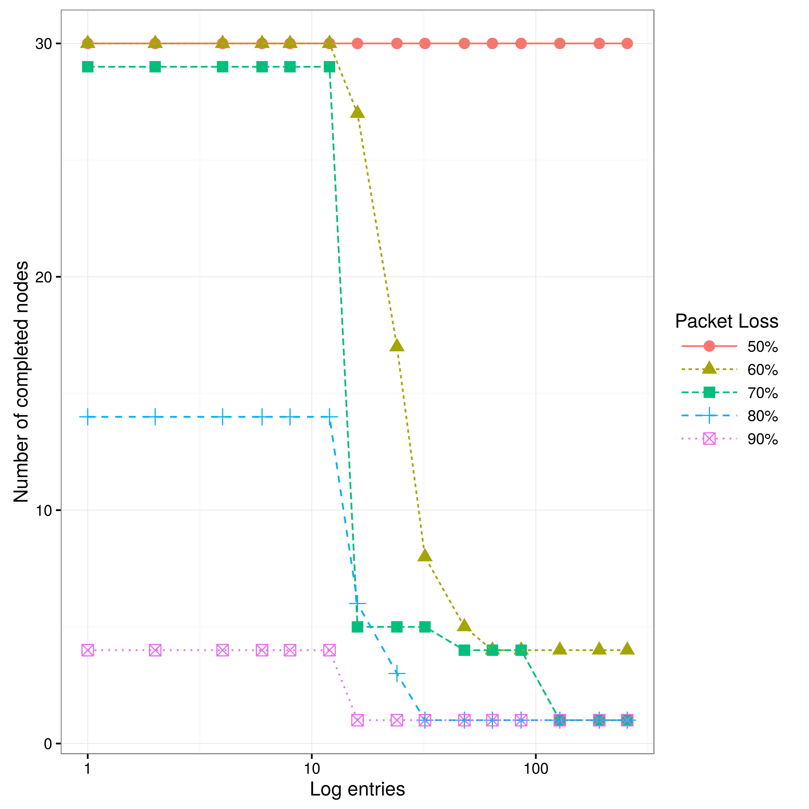
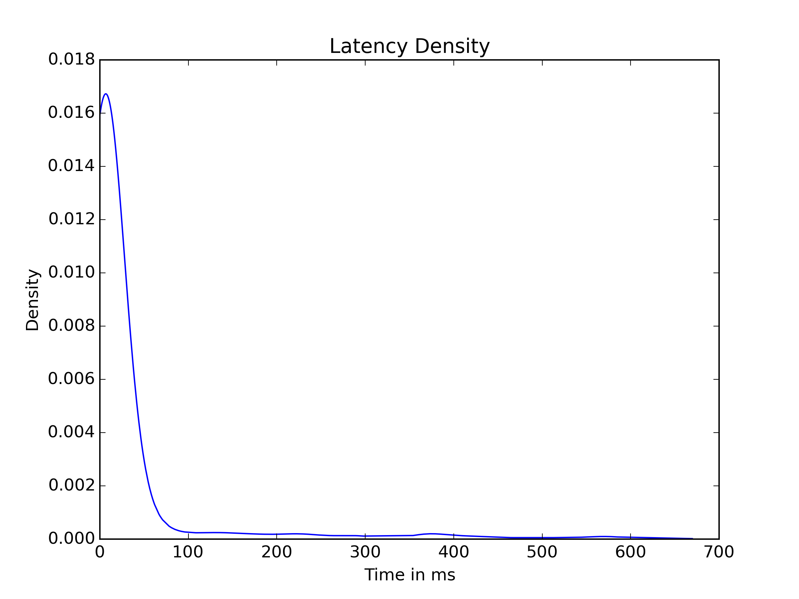
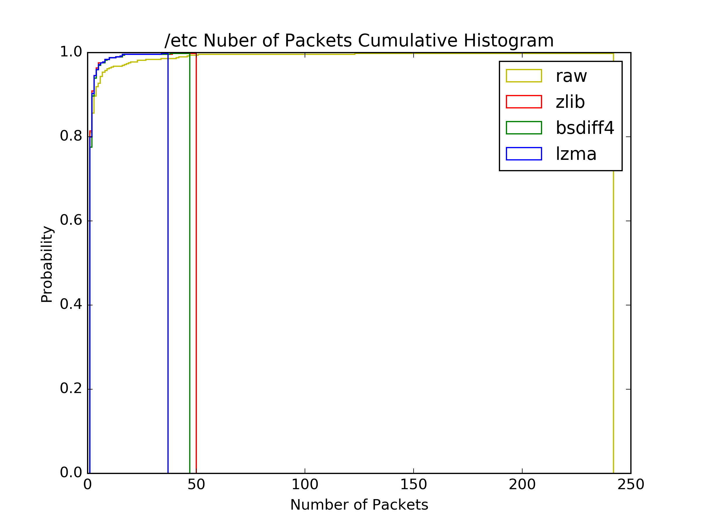

# Evaluation

BaseFS implementation has been extensively tested in multiple ways. In this section we present an evaluation of the BaseFS network properties and IO performance. For the validation of the Merkle DAG conflict resolution and permissions the reader can refere to the [unit and functional tests](https://github.com/glic3rinu/basefs/tree/master/basefs/tests) shiped with BaseFS source code.

We have developed our own [test suit](https://github.com/glic3rinu/basefs/tree/master/eval) and all test scenarios have been fully automated for easily reproducability. The test suite is based on Docker containers and TC. Docker builds on top of the Linux kernel resource isolation features to provide operating-system-level virtualization, providing abstraction and automation. On the other hand, TC (Linux Traffic Control), is a shell utility that can be used for configuring the kernel network scheduler and shape the traffic characteristics at will, like packet loss and delay.

It is also worth mentioning that we also have implemented a BaseFS [built-in profiler](https://github.com/glic3rinu/basefs/blob/master/basefs/management/resources.py), it keeps track of resource usage and other metrics like memory, CPU, network usage or context switches.


# Network Evaluation

The network evaluation is separated in three subsections. The first two are independent evaluations of the gossip layer and the sync protocol on a virtual environment using Docker and TC. By shaping the traffic we are able to see how differnet network conditions affects the convergence characteristics and traffic usage of both protocols. With that information we will be able to do an informed decission about the prefered values for `MAX_GOSSIPED_BLOCKS` and `SYNC_RUNNING_INTERVAL`. Then we will configure BaseFS and evaluate the behaviour of both protocols working togerther. BaseFS will be tested with a virtual environment with more ideal conditions and compared with the results of the same experiment using Community-Lab test.

For all experiments we define a set of 30 nodes, we perform all writes on the same machine, and then we collect the time at with the other nodes have received all related messages.

We are going to evaluate the convergence properties and traffic characteristics usage of the gossip layer and the sync protocol. We define convergence as te time required for a log entry to spread to the entire cluster.


First we will study the gossip layer and the sync protocol independently. We will see how network conditions like delay, packet loss, packet reordering or bandwith limitations affects the spread of log entries using the gossip layer, and we will see how the synchronization interval affects the convergence time and traffic usage of the synchronization protocol.

assumptions: all writes com from the same node

Serf claims of convergense under packet loss does not hold

## Gossip Layer

For settings this experiment we have disabled the sync protocol and configured `max_gissiped_blocks` to an arbitrary large number, the only communications between basefs instances will be by means of the gossip layer.


### Delay effects

By default, Basefs is configured for using Serf WAN profile, which a ProbeTimeout of 3 seconds. This is important because under network latency greater than 3 seconds nodes will be reported as failed, messages will not spread and the protocol will not converge.

https://github.com/hashicorp/memberlist/blob/master/config.go#L178

TODO delay 1500


### Packet loss effects

Serf WAN profile is configured with GossipNodes of 4 nodes. Because gossip messages are transported over UDP, without acknowledgment of received data, packet loss will have a large impact on the convergence time of the gossip layer. Under significant packet loss scenarios, Serf full sync TCP protocol will have the job of delivering most of the messages. Under heavy packet loss conditions convergence will be extremly difficult because of the added problem of detecting nodes as failing.


TODO strech time and make the gossip layer converge
sustained packet loss convergence problems: UDP messages are lost and Serf TCP sync has great difficulty of making the cluster converge on a reasonable amount of time. Probably given enough time all scenarios will finally converge.


### Packet reordering effects

Packet reordering does not have any significant effect on our experiments becuase messages are generated in bursts, and they will not be gossiped in order anyway.


### Bandwith limitations effects


TODO repeate 56 32kbps give it more time for final convergion. 
Serf gossip protocol behaves decently under high constrained bandwith conditions. It is not until we reduce the traffic to 56kbps and generate a burst of 100 messages 




## Sync Protocol

### Interval effects sync protocol


## BaseFS


Define a realistic scenario, tune the max_gossiped_blocks and sync_interval to a reasonable values.


Now we study the BaseFS behaviour, gossip and sync protocols working in tandem in two different envirnoments. First using a simulated perfect environment using Docker, and then we replicate the experiment on COnfine testbed.

The generated workload consists of 560 writes separated by 3 seconds. The writes are crafted in order to generate predetermined amount of gossip packets, simulating a workload typical configuration management operations. We have erred on the side of more packets than those we believe will be acctually needed on real scenario, since configuration updates usually involves a really small amount of data that can easily fit into a single gossip message.

0:     340 0.60
1:     160 0.28
2:      20 0.03
4:      20 0.03
16:     20 0.03
total: 560 writes

### Docker
 Controlled Virtual environment with Docker and TC
    * Each node runs on a Debian 6 Docker container with a virtual ethernet device. Nodes are connected with one level 2 hop between them. This is a controlled environment and we use Linux traffic control to emulate variable delay, packet loos, duplication and re-ordering, in order to understand its effects on BaseFS's communication protocols.

#### Convergence Time


#### Packet loss




#### Traffic usage
    * How much overhead?


#### Traffic balance
    * Is the traffic usage well balance between nodes?


### CommunityLab testbed
 Ralistic environment on Confine testbed
    * Each BaseFS node runs on a Debian LXC container on top of a Confine Node. Confine Nodes are heterogeneous devices and resources are share with other ongoing experiments, which makes for a very inconsistent performance characteristics. All our nodes are connected using the native IP network provided by different community networks where Confine nodes are deployed. Since we don't have much control of the underlying infraestructure we provide a network characterization to better understand the environment where the experiment is taking place.

#### Network characterization
Because we run the experiment on a pre-existing and not configurable network topology we need to characterize and discover the propertires of the network to have a better understanding of the experimental results.





#### Convergence Time


#### Traffic usage


#### Traffic balance


# /ETC Characterization
Is the gossip layer a good transport protocol for configuration replication? Is BaseFS Merkle DAG consensus strategy effective enough for solving configuration conflicts?

1. How many Gossip packets (512b) we will need?
BSDIFF4 produces very space-efficient patches 




2. How many conflicts can we expect?

= File Operations Performance =


In order to understand the read and write perfomance characteristics we compare BaseFS with a more traditional and popular file system (EXT4). This experiment shows how file updates affects read/write completion time. The experiemnt consists on copying up to 30 times the entire content of the `/etc/` root directoy (files, directories and simbolic links). The idea is to put a lot of stress on to the weakes performance points of our BaseFS implementation; the view and the binary difference computations.

TODO meassure context switches: use perf: sudo perf stat -a echo Hi;
TODO why content cache is not used during writes?

Read/write performance compared to traditional filesystems (ext4) [script](docker/performance.sh)

```bash
bash experiment 2
bash performance.sh
```
### Write performance


Two costly operations:
    compute the view
    apply every binary difference patch for each file


Cache invalidation is a hard problem to takle and its effectively limiting what we are able to cache without paying too much on implementation complexity. For one, the conflict-free view of the entire filesystem is recomputed on reads that come after writes. On the other hand, the file content is also invalidated on a write operation and the binary difference has to be computed using all the BSDIFF4 patches that have been generated since file creation, increassing the cost on each update.

We have made the choice of using BSDIFF4 binary deltas on the grounds that write-intensive workloads are not expected for a cluster configuration tool and a faster convergence time (less messages to gossip) is a more desirable characteristic. 


### Read performance


Read performance is also linearly affected by the number of patches that are required to apply in order to retrieve the most recent content of every file. However, a BaseFS cached read provides good and consistent performance.


= NOTES = 


http://www.linuxfoundation.org/collaborate/workgroups/networking/netem
    tc -s qdisc ls dev eth0

netem provides Network Emulation functionality for testing protocols by emulating the properties of wide area networks.

Delay
-----
Typically, the delay in a network is not uniform. It is more common to use a something like a normal distribution to describe the variation in delay. The netem discipline can take a table to specify a non-uniform distribution.

100ms ± 20ms

Reorder
-------
In this example, 25% of packets (with a correlation of 50%) will get sent immediately, others will be delayed by 10ms.
tc qdisc change dev eth0 root netem delay 10ms reorder 25% 50%

Packet loss
-----------
An optional correlation may also be added. This causes the random number generator to be less random and can be used to emulate packet burst losses.
This will cause 0.3% of packets to be lost, and each successive probability depends by a quarter on the last one.
Probn = .25 * Probn-1 + .75 * Random

Bandwidth
--------
 There is no rate control built-in to the netem discipline, instead use one of the other disciplines that does do rate control. In this example, we use Token Bucket Filter (TBF) to limit output.
 50 packets buffer (seems to be the deafult, 75000bytes, )
 
* burst, also known as buffer or maxburst. Size of the bucket, in bytes. This is the maximum amount of bytes that tokens can be available for instantaneously. In general, larger shaping rates require a larger buffer. For 10mbit/s on Intel, you need at least 10kbyte buffer if you want to reach your configured rate!
 https://en.wikipedia.org/wiki/Token_bucket
* limit or latency Limit is the number of bytes that can be queued waiting for tokens to become available. latency parameter, which specifies the maximum amount of time a packet can sit in the TBF
