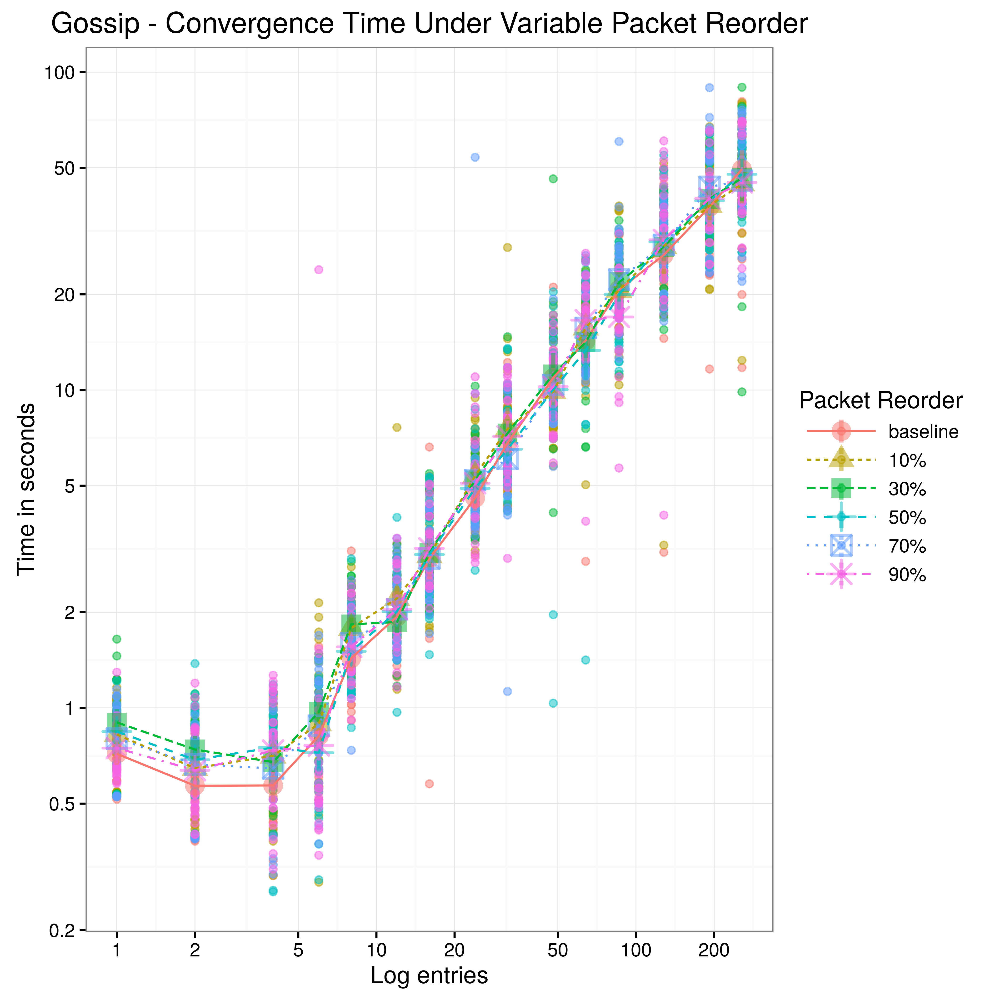
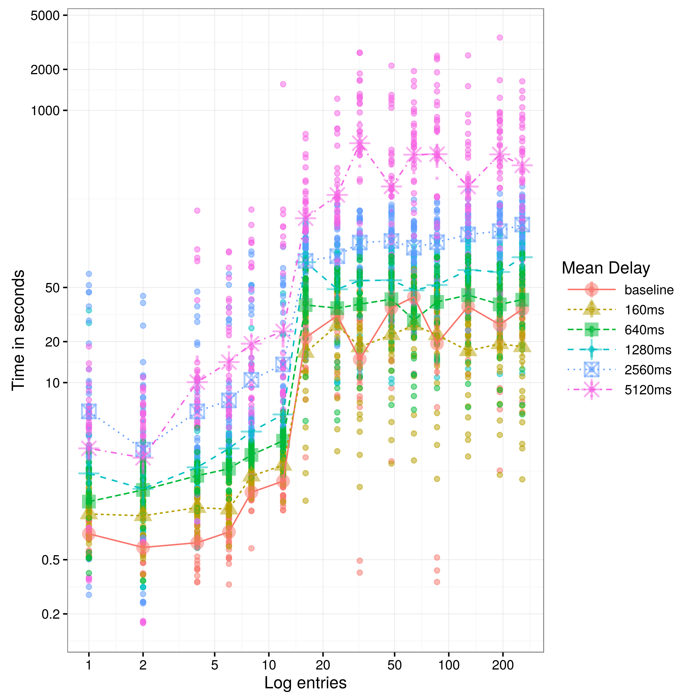
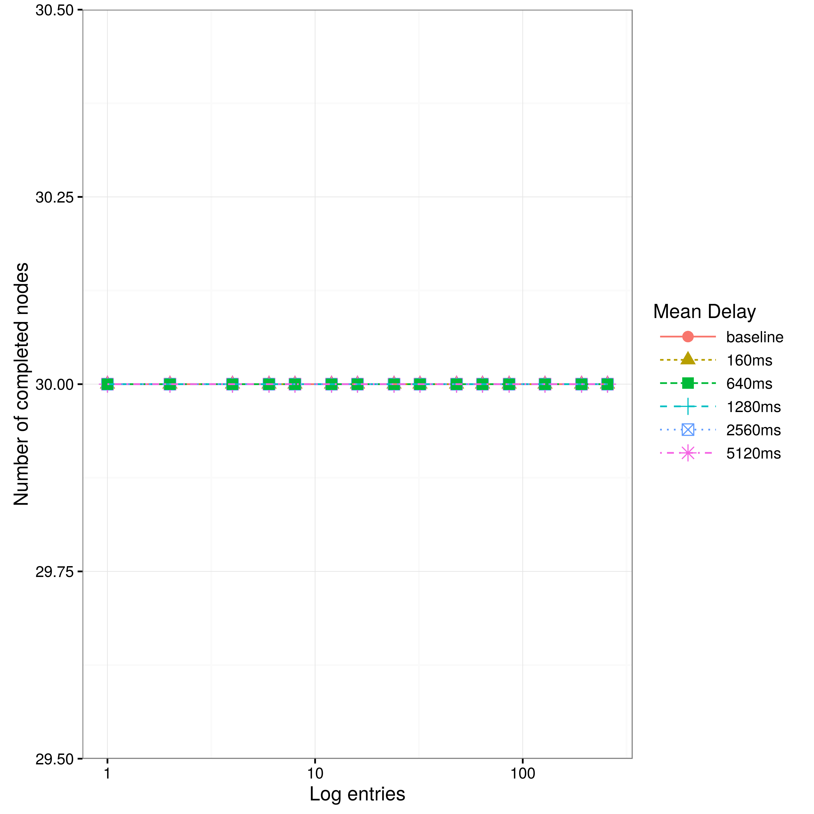
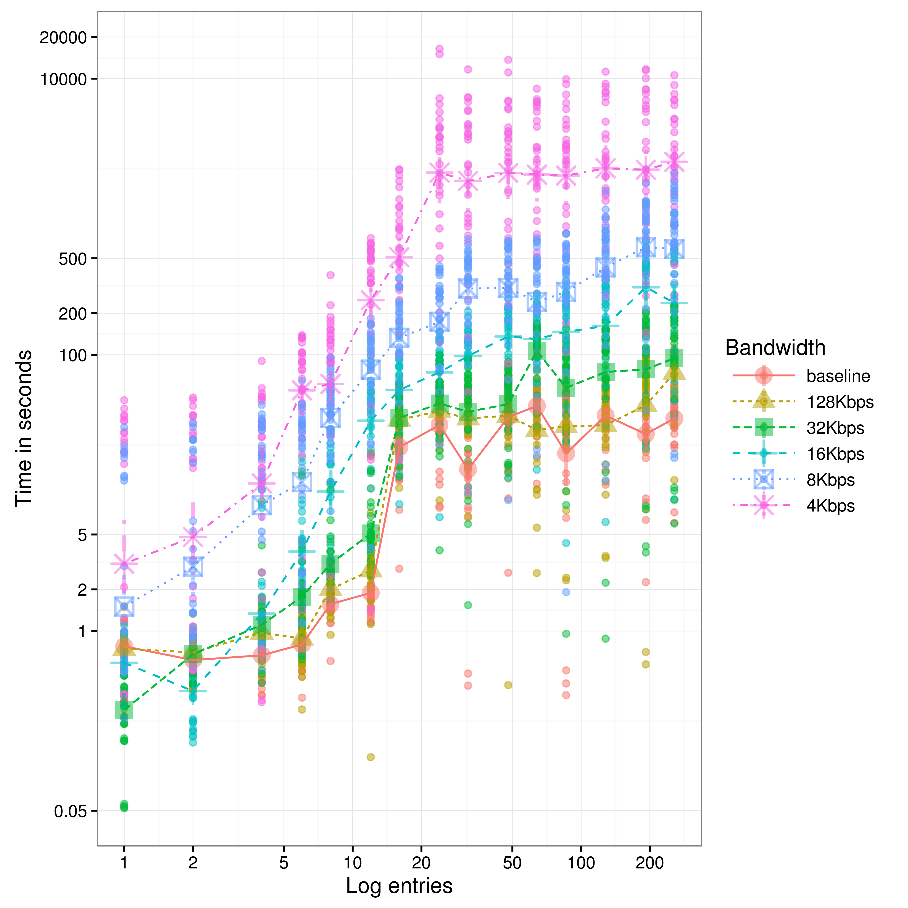
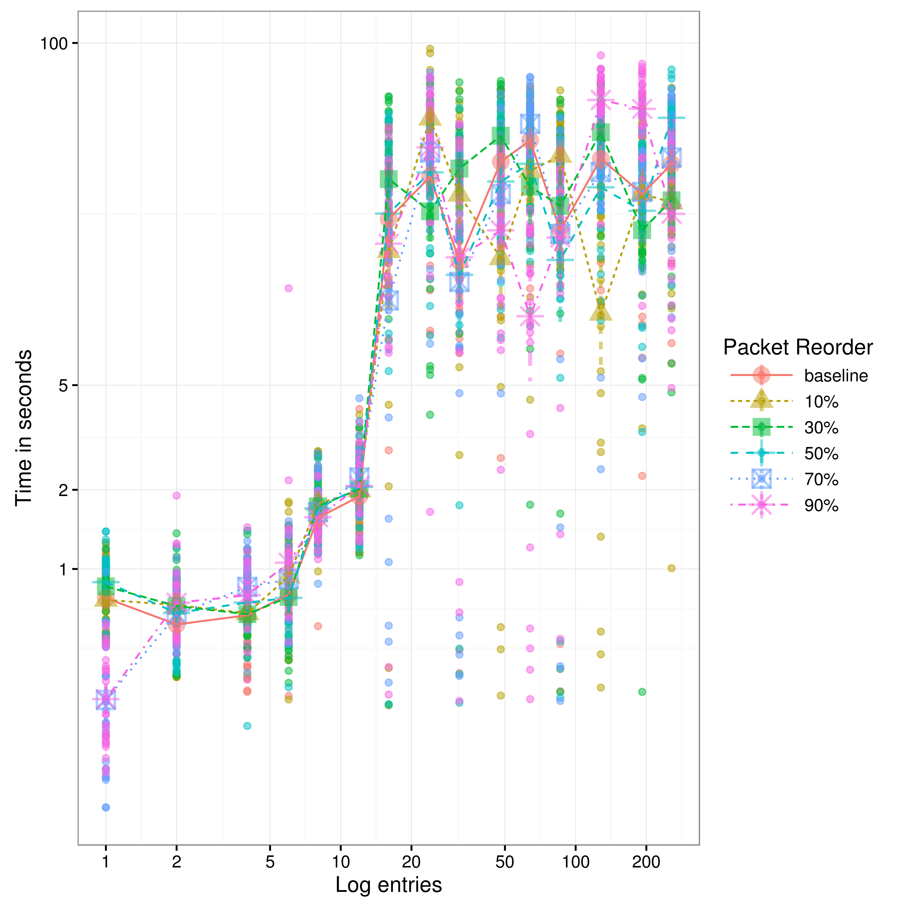
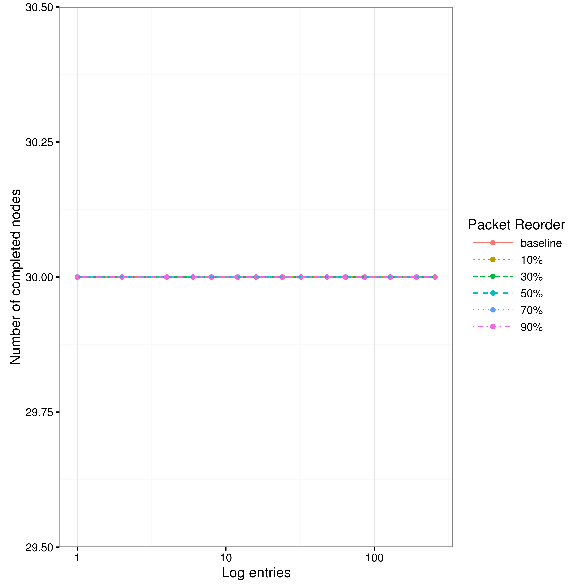
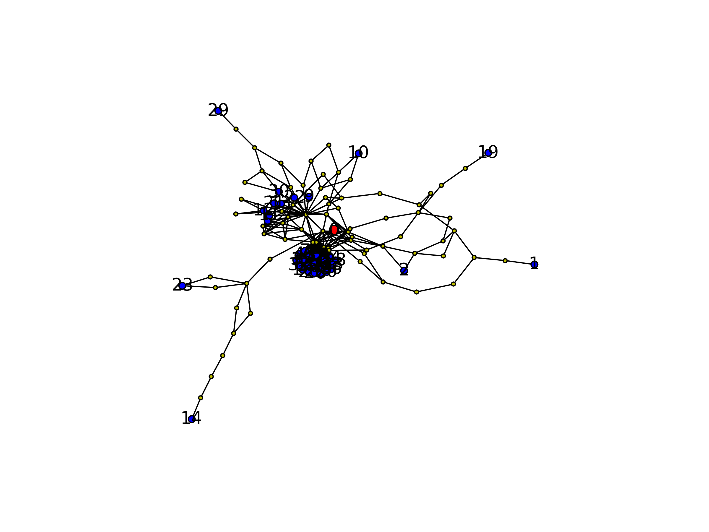
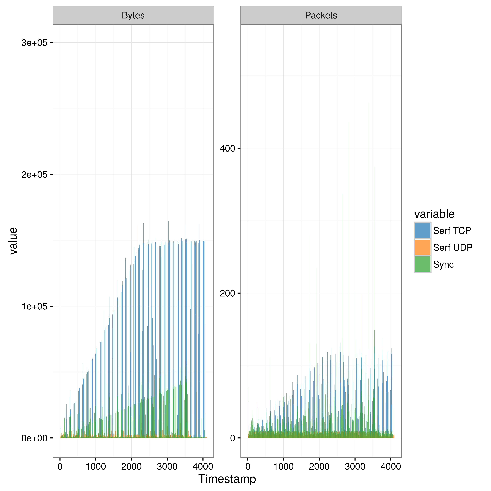
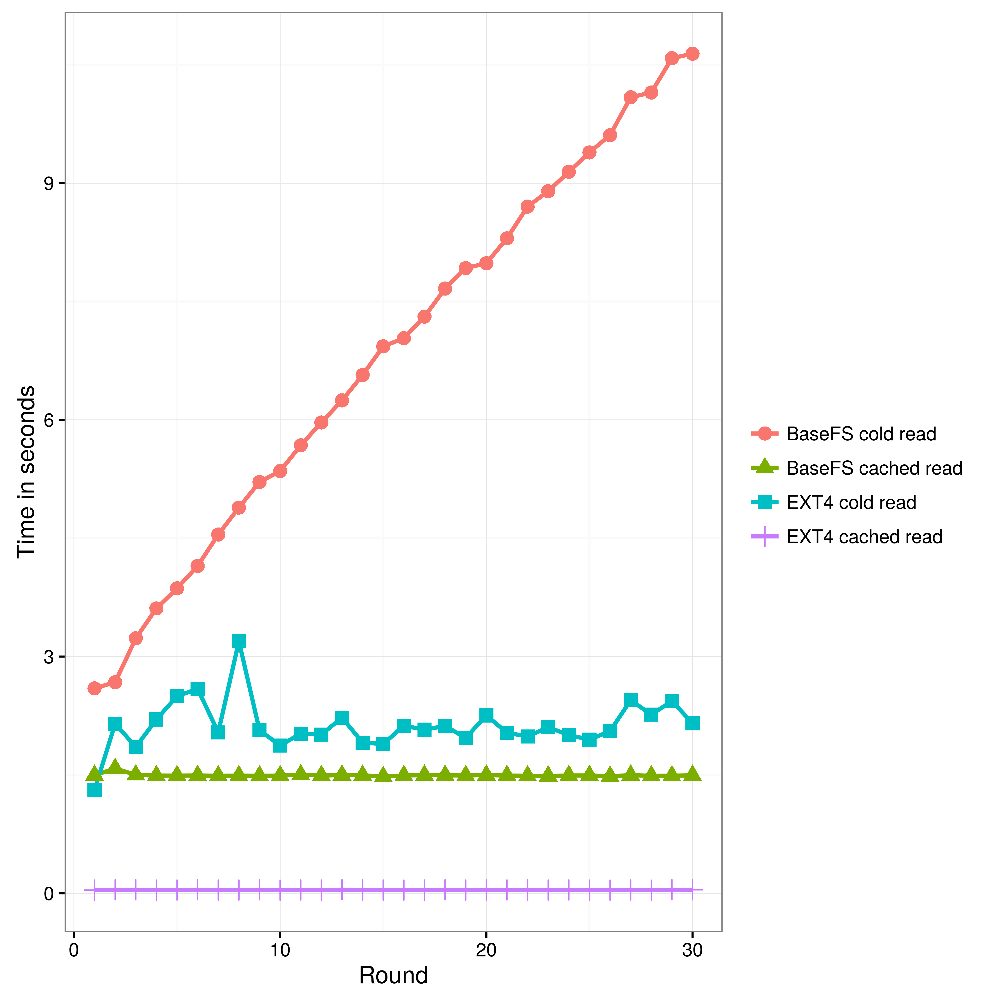

# Evaluation

In this section we present an evaluation of the BaseFS network properties and IO performance. For the validation of the Merkle DAG conflict resolution and permissions the reader can refere to the [unit and functional tests](https://github.com/glic3rinu/basefs/tree/master/basefs/tests) shiped with BaseFS source code.

All test scenarios have been fully automated for easily reproducability. We have developed our own [test suit](https://github.com/glic3rinu/basefs/tree/master/eval). The test suite has support for virtual environments based on Docker containers and TC, as well as support for Community-Lab testbed. Docker builds on top of the Linux kernel resource isolation features to provide operating-system-level virtualization. On the other hand, TC (Linux Traffic Control), is a shell utility that can be used for configuring the kernel network scheduler and shape the traffic characteristics at will, like packet loss and delay. Community-Lab is Community Netwotk Testbed by the CONFINE project that provides a global facility for experimentation with network technologies and services for community networks. Support for deploying, orchestrating and collecting experimental data on Community-Lab is provided by utilities written in Bash and Python, using concurrent [multiplexed](https://en.wikibooks.org/wiki/OpenSSH/Cookbook/Multiplexing) SSH sessions underneeth.

It is also worth mentioning that BaseFS has a [built-in profiler](https://github.com/glic3rinu/basefs/blob/master/basefs/management/resources.py) that keeps track of resource usage and other metrics like memory, CPU, network usage or context switches.


# Network Evaluation

The network evaluation is separated into three main phases. The first two are independent evaluations of the *gossip layer* and the *sync protocol* on a virtual environment using Docker and TC. By shaping the traffic we are able to see how differnet network conditions affect the convergence characteristics and traffic usage of both protocols. With that information we will move to the next phase and make an informed decission about the prefered values for `MAX_BLOCK_MESSAGES` and `FULL_SYNC_INTERVAL`. Then we will evaluate the behaviour of both protocols working togerther. In this phase, BaseFS will be additionally tested on Community-Lab.

Each experiment is performed on a cluster of 30 nodes. For each experiment a new *BaseFS log* is bootstraped. Nodes get and mount this freshly created BaseFS filesystem. The cluster members are given a few seconds to find each other. We simulate configuration updates by copying a set of pre-created files into one of the nodes BaseFS mounted partition. Then we meassure the time it takes for the configuration file to propagate to the rest of the cluster. The test files have different sizes but they are always the same on all experiments, so the results are comparable. We monitor the number of converged nodes in real time, so the experiment can advance as soon as all nodes have received the updates. We define a maximum waitting time of 100 minutes between file copies, with an additional maximum of 150 minuts at the end of each experiment.


## Gossip Layer

For the gossip layer experiments we have disabled BaseFS sync protocol and configured `MAX_BLOCK_MESSAGES` to an arbitrary large number, enssuring that the only communications between BaseFS nodes will be by means of the gossip layer. We will see how network conditions like delay, packet loss, packet reordering or bandwith limitations affects the convergence time of the cluster. We define convergence as te time required for a log entry, and its related blocks, to spread over the entire cluster.

Serf WAN
```golang
conf.TCPTimeout = 30 * time.Second
conf.SuspicionMult = 6
conf.PushPullInterval = 60 * time.Second
conf.ProbeTimeout = 3 * time.Second
conf.ProbeInterval = 5 * time.Second
conf.GossipNodes = 4 // Gossip less frequently, but to an additional node
conf.GossipInterval = 500 * time.Millisecond
```

### Delay effects

TC netem discipline provides network emulation functionality for testing protocols by emulating the properties of wide area networks. In this section we will see how the gossip layer, or Serf for that matter, is affected by packet delay. Typically, the delay in a network is not uniform. It is more common to use a something like a normal distribution to describe the variation in delay. We have created multiple distributions with different mean, and a designated standard deviation of 20% of the mean value on each case.

`netem delay 100ms 20ms distribution normal`


Serf is configured to use the *WAN profile* with a `ProbeTimeout` of about 3 seconds. This is important because under network latency greater than 3 seconds nodes will be reported as failed. In this experiment, Serf failure detector mechanism show its robustnes. Because of the delay normal distribution, some packets will still get lower than 3 seconds delays, andvalues messages will not spread and the protocol will not converge. This is further confirmed by looked at Serf debugging messages, we start to get some `Marking 0242ac110014-8ab678bdbfa1 as failed, suspect timeout reached` from delay mean starting from 1280ms.


How relevant latency is in the context of Community Networks? DOes long distance wireless links add lots of it? is bufferbloat worth mentioning since UDP is not that much affected?

https://github.com/hashicorp/memberlist/blob/master/config.go#L178

this is where the limitations of the gossip protocol start to show up

memberlist: Suspect 0242ac11001b-14a14421b7a6 has failed, no acks received
memberlist: Push/Pull with 0242ac11000c-933a0c4aa9ca failed: Reading remote state failed: read tcp 172.17.0.12:18374: i/o timeout
Suspect 0242ac11001b-14a14421b7a6 has failed, no acks received


Serf perform surprisingly well under very large delays. 


### Packet loss effects


In this section we evaluate the packet loos effects on the gossip layer. We have used the *netem* module to simulate various degrees of packet loss. In real networks, packets are lost in bursts, with a non independent probability. Netem allows to specify a *correlation value* and simulate packet loss episodes. `netem loss 30% 25%` will cause 30% of packets to be lost, and each successive probability depends by a quarter on the last one.

`Probn = .25 * Probn-1 + .75 * Random`

For our test we have evaluated packet loss in increments of 10% and a constant correlation of 25%. Figure 2 shows de results of such experiments. Figure 3 shows the % of convergence reached on each scenario.


For understanding the results, we need to know that Serf WAN profile is configured with `GossipNodes` of 4 nodes, meaning that nodes will gossip a message to another 4 random peers. Because gossip messages are transported over UDP, without acknowledgment of received data, heavy packet loss has a large impact on the convergence time. To mitigate this effect Serf runs a second protocol for performing periodic full state synchronization. But still, Figure 2 shows how intense packet loss prevents the cluster from converging. Looking at the Serf debug logs, collected during the experiment, we can make two educated guesses about the reasos why. First, it may be because members are continually reported as failed and peers do not attempt to contact them. Second, Serf event queue has a limit of messages it can hold, this may have a cumulative effect and earlier messages are lost before the full state sync can have a chance to work its magic. In any case, packet loss up to 20% does not seem to have a significative effect, up to 50% of packet loss the protocol can converge on all scenarios. Things get ugly at 80% of packet loss, but under that conditions the entire network would be rendered usseless anyway.


### Packet reordering effects
Packet reordering or out-of-order delivery is the delivery of data packets in a different order from which they were sent. Out-of-order delivery can be caused by packets following multiple paths through a network. Netem can simulate reordering, with correlation, in a similar way as how packet loss is specified `netem reorder $3% 25%`.



Packet reordering happens naturally during the execution of a gossip protocol; nodes are expected to receive messages from different nodes at different order. This is why no matter how sever it is, our simulated packet reordering has no effect whatsoever on the convergence time of the gossip layer.


### Bandwith limitations effects
For rate control we use Hierarchical Token Buckets (HTB) queueing dicipline that allows to define link data rates as easy as `htb rate 32kbit`. It is true that on wireless networks link speed may be something very dynamic under acute interference. However, we will not simulate dynamic 


The results are consistent from what is expected from Serf. Using the [simulator](https://www.serfdom.io/docs/internals/simulator.html) with [WAN parameters](https://github.com/hashicorp/memberlist/blob/master/config.go#L196) Gossip Fanout of 4, Gossip Interval of 0.5 seconds and a number of 30 nodes, we get an estimated max bandwidth: 175 kbps/node

Received event: member-failed
Suspect 0242ac110012-e98725c7c319 has failed, no acks received
 
TODO repeate 56 32kbps give it more time for final convergion. 
Serf gossip protocol behaves decently under high constrained bandwith conditions. It is not until we reduce the traffic to 56kbps and generate a burst of 100 messages 


 There is no rate control built-in to the netem discipline, instead use one of the other disciplines that does do rate control. In this example, we use Token Bucket Filter (TBF) to limit output.
 50 packets buffer (seems to be the deafult, 75000bytes, )
 
* burst, also known as buffer or maxburst. Size of the bucket, in bytes. This is the maximum amount of bytes that tokens can be available for instantaneously. In general, larger shaping rates require a larger buffer. For 10mbit/s on Intel, you need at least 10kbyte buffer if you want to reach your configured rate!
 https://en.wikipedia.org/wiki/Token_bucket
* limit or latency Limit is the number of bytes that can be queued waiting for tokens to become available. latency parameter, which specifies the maximum amount of time a packet can sit in the TBF


## Sync Protocol


The key characteristic for the sync protocol is how the synchronization interval affects the convergence time and traffic usage of the synchronization protocol


### Interval effects sync protocol


## BaseFS


Define a realistic scenario, tune the `MAX_BLOCK_MESSAGES` and `FULL_SYNC_INTERVAL` to a reasonable values.


Now we study the BaseFS behaviour, gossip and sync protocols working in tandem in two different envirnoments. First using a simulated perfect environment using Docker, and then we replicate the experiment on COnfine testbed.

The generated workload consists of 560 writes separated by 3 seconds. The writes are crafted in order to generate predetermined amount of gossip packets, simulating a workload typical configuration management operations. We have erred on the side of more packets than those we believe will be acctually needed on real scenario, since configuration updates usually involves a really small amount of data that can easily fit into a single gossip message.

0:     340 0.60
1:     160 0.28
2:      20 0.03
4:      20 0.03
16:     20 0.03
total: 560 writes

### Docker
 Controlled Virtual environment with Docker and TC
    * Each node runs on a Debian 6 Docker container with a virtual ethernet device. Nodes are connected with one level 2 hop between them. This is a controlled environment and we use Linux traffic control to emulate variable delay, packet loos, duplication and re-ordering, in order to understand its effects on BaseFS's communication protocols.

#### Convergence Time


#### Packet loss

*Sync protocol depends on the gossip layer for membership* if members are reported as failed by serf the sync protocol will not contact them.











#### Traffic usage
    * How much overhead?


#### Traffic balance
    * Is the traffic usage well balance between nodes?


### CommunityLab testbed
 Ralistic environment on Confine testbed
    * Each BaseFS node runs on a Debian LXC container on top of a Confine Node. Confine Nodes are heterogeneous devices and resources are share with other ongoing experiments, which makes for a very inconsistent performance characteristics. All our nodes are connected using the native IP network provided by different community networks where Confine nodes are deployed. Since we don't have much control of the underlying infraestructure we provide a network characterization to better understand the environment where the experiment is taking place.

#### Network characterization
Because we run the experiment on a pre-existing and not configurable network topology we need to characterize and discover the propertires of the network to have a better understanding of the experimental results.





#### Convergence Time


#### Traffic usage


#### Traffic balance


# /ETC Characterization
Is the gossip layer a good transport protocol for configuration replication? Is BaseFS Merkle DAG consensus strategy effective enough for solving configuration conflicts?

1. How many Gossip packets (512b) we will need?
BSDIFF4 produces very space-efficient patches 


2. How many conflicts can we expect?


# File Operations Performance

In this secction we compare BaseFS to a more traditional file system (EXT4). We made the experiments to roughly show how file updates affect read and write performance at the filesystem level, while having a known filesystem to help putting results into prespective. The experiemnt consists on copying up to 30 times the entire content of the `/etc/` root directoy (files, directories and simbolic links), simulating the write workload that we can expect from a configuration managemnet utility.

The /etc directory of the testing machine contained

* 2512 files
* 1350 symbolic links
* 462 directories
* 22 MB of data


Bear in mind that we are comparing a kernelspace filesystem (EXT4) with a userspace virtual filesystem that requires to run complex algorithms on top of cPyhton, with the additional FUSE layer and the added cost of having to context switch into kernel mode for performing system calls.


### Read performance

Starting from a fresh log file, on each round we recursively copy the entire `/etc` directory into BaseFS mounted directory. Then we perform two reads, the first needs to compute the binary difference of every previous version, but the second is cached. We do the same with an EXT4 filesystem stored on a SATA drive. In this case, however, we perform a `sync && echo 3 > /proc/sys/vm/drop_caches` after every write i order to clean any possible caching and do the first read as cold as the BaseFS one.




As expected, cold read performance is linearly affected by the incresing number of patches requiered to apply for obtaining the most recet version of the content of each file. However, a cached BaseFS reads are faster than uncached EXT4 reads, being able to read the entire filesystem clocked at about 2 seconds.


### Write performance

Figure 10 shows how BaseFS write performance compares to EXT4. We can see how in each additional recursive copy of the `/etc` directory into the BaseFS partition increases the cost consistently. Apart from writing to the log file, BaseFS calculates the binary difference of each file and computes the conflict-free *view* of the filesystem. Sure, this process can be greatly optimized, however we should not be really concern about the performance of massive write operations, since cluster configuration is about changing bits of information, and we have already demonstrated the subsecond convergence properties of BaseFS


Cache invalidation is a hard problem to takle and its effectively limiting what we are able to cache without paying a great cost on implementation complexity. For one, the conflict-free view of the entire filesystem is recomputed on reads that come after writes. On the other hand, the file content is also invalidated on a write operation and the binary difference has to be computed using all the BSDIFF4 patches that have been generated since file creation, increassing the cost on each update.

We have made the choice of using BSDIFF4 binary deltas on the grounds that write-intensive workloads are not expected for a cluster configuration tool and a faster convergence time (less messages to gossip) is a more desirable characteristic. 


In order to understand the read and write perfomance characteristics we compare BaseFS with a more traditional and popular file system (EXT4). This experiment shows how file updates affects read/write completion time. 

TODO meassure context switches: use perf: sudo perf stat -a echo Hi;
TODO why content cache is not used during writes?

Read/write performance compared to traditional filesystems (ext4) [script](docker/performance.sh)

```bash
bash experiment 2
bash performance.sh
```

Cluster configuration does not need to hold up to high intensive IO workloads, a faster convergence time is a more interessting property. However, BaseFS does remarkably well, even though it has not been finely tuned for filesystem IO performance.


BaseFS makes extensive use of concurrency including processes, threads and an event loop. The FUSE interface runs on the main Python thread, as required by its implementation. The Serf agent runs on a separated Python process, and we talk with it using Serf own RPC protocol. We spawn an additional thread for the event loop. Implemented with asyncio, the event loop handles all the reamaining network communication in a non-blocking fashion, including the sync protocol, receiving of custom gossip events and commands sent by BaseFS CLI utility. The event loop thread shares memory with the main FUSE thread, and only a single instance of the View has to be maintained, saving memory and computation time.


= NOTES = 


http://www.linuxfoundation.org/collaborate/workgroups/networking/netem
    tc -s qdisc ls dev eth0


[WARN] serf: Event queue depth: 797

