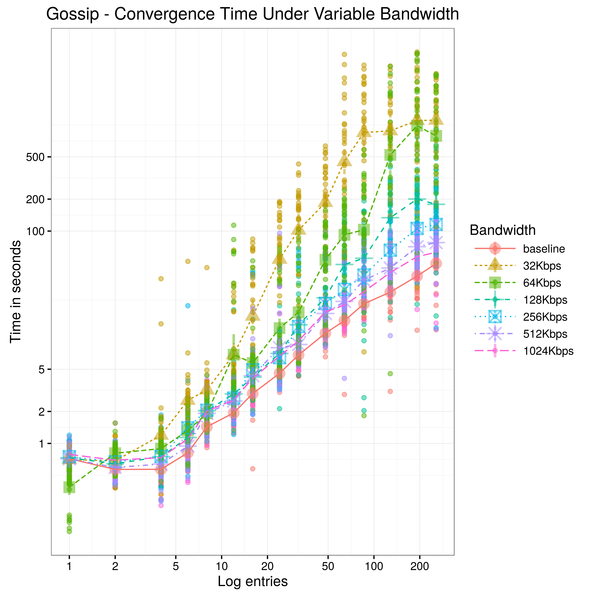
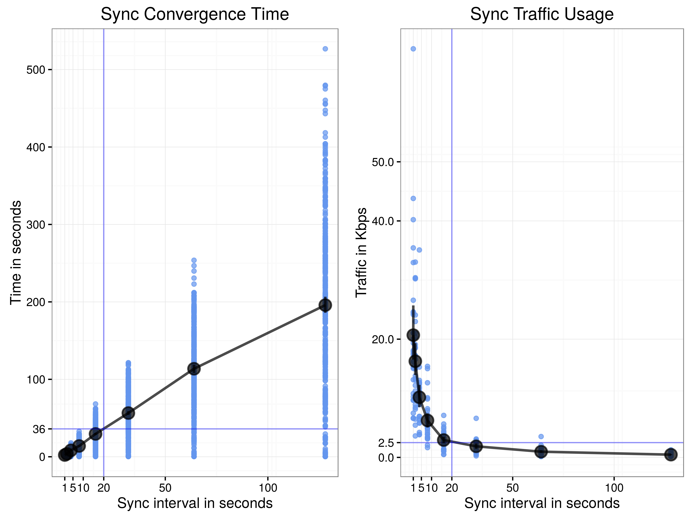
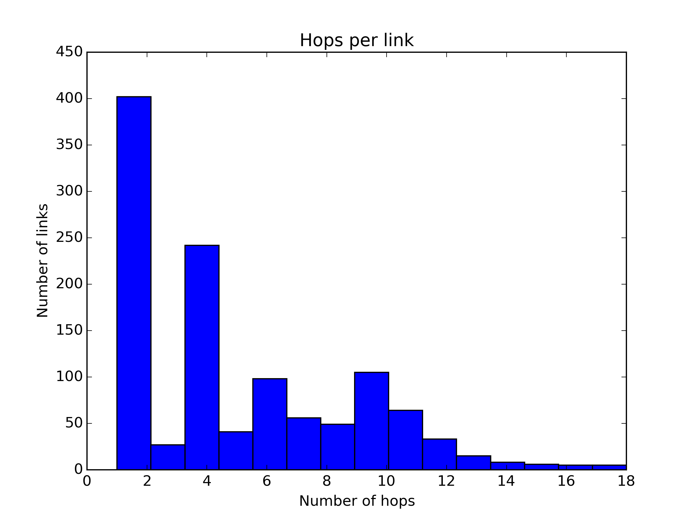

# Evaluation

In this section we present an evaluation of the BaseFS network properties and IO performance. For the validation of the Merkle DAG conflict resolution and permissions the reader can refere to the [unit and functional tests](https://github.com/glic3rinu/basefs/tree/master/basefs/tests) shiped with BaseFS source code.


All test scenarios have been fully automated for easily reproducability. For that we have developed our own [test suit](https://github.com/glic3rinu/basefs/tree/master/eval). The test suite has support for virtual environments based on Docker containers and TC, as well as support for Community-Lab testbed. Docker builds on top of the Linux kernel resource isolation features to provide operating-system-level virtualization. On the other hand, TC (Linux Traffic Control), is a shell utility that can be used for configuring the kernel network scheduler and shape the traffic characteristics at will, like packet loss and delay. Community-Lab is Community Netwotk Testbed by the CONFINE project that provides a global facility for experimentation with network technologies and services for community networks. Support for deploying, orchestrating and collecting experimental data on Community-Lab is provided by utilities written in Bash and Python, using concurrent [multiplexed](https://en.wikibooks.org/wiki/OpenSSH/Cookbook/Multiplexing) SSH sessions underneeth.

It is also worth mentioning that BaseFS has a [built-in profiler](https://github.com/glic3rinu/basefs/blob/master/basefs/management/resources.py) that keeps track of resource usage and other metrics like memory, CPU, network usage or context switches.


# Network Evaluation

The network evaluation is separated into three main phases. The first two are independent evaluations of the *gossip layer* and the *sync protocol* on a virtual environment using Docker and TC. By shaping the traffic we are able to see how differnet network conditions affect the convergence characteristics and traffic usage of both protocols. With that information we will move to the next phase and make an informed decission about the prefered values for `MAX_BLOCK_MESSAGES` and `FULL_SYNC_INTERVAL`. Then we will evaluate the behaviour of both protocols working togerther. In this phase, BaseFS will be additionally tested on Community-Lab.

Each experiment is performed on a cluster of 30 nodes. For each experiment a new *BaseFS log* is bootstraped. Nodes get and mount this freshly created BaseFS filesystem. We leave a few seconds for the cluster members to find each other. We simulate configuration updates by copying a set of pre-created files into one of the nodes BaseFS mounted partition. Then we meassure the time it takes for the configuration file to propagate to the rest of the cluster. The test files are the same on all experiments, so the results are comparable. We monitor the number of converged nodes in real time, so the experiment can advance as soon as all nodes have received the updates. We define a maximum waitting time of 100 minutes between files, with an additional maximum of 150 minuts at the end of each experiment.


## Gossip Layer

For the gossip layer experiments we have disabled the sync protocol and configured `MAX_BLOCK_MESSAGES` to an arbitrary large number, enssuring that the only communications between BaseFS nodes will be by means of the gossip layer. We will see how network conditions like delay, packet loss, packet reordering or bandwith limitations affects the convergence time of the cluster. We define convergence as te time required for a log entry and its related blocks to spread to the entire cluster.

Serf WAN
```golang
conf.TCPTimeout = 30 * time.Second
conf.SuspicionMult = 6
conf.PushPullInterval = 60 * time.Second
conf.ProbeTimeout = 3 * time.Second
conf.ProbeInterval = 5 * time.Second
conf.GossipNodes = 4 // Gossip less frequently, but to an additional node
conf.GossipInterval = 500 * time.Millisecond
```

### Delay effects

TC netem discipline provides Network Emulation functionality for testing protocols by emulating the properties of wide area networks. Typically, the delay in a network is not uniform. It is more common to use a something like a normal distribution to describe the variation in delay. We use a mean delay +- 20% For example:

`netem delay 100ms 20ms distribution normal`

Serf is configured to use the *WAN profile* with a `ProbeTimeout` of about 3 seconds. This is important because under network latency greater than 3 seconds nodes will be reported as failed, messages will not spread and the protocol will not converge. This is further confirmed by looked at Serf debugging messages, we start to get some `Marking 0242ac110014-8ab678bdbfa1 as failed, suspect timeout reached` from delay mean starting from 1280ms.

https://github.com/hashicorp/memberlist/blob/master/config.go#L178

this is where the limitations of the gossip protocol start to show up

memberlist: Suspect 0242ac11001b-14a14421b7a6 has failed, no acks received
memberlist: Push/Pull with 0242ac11000c-933a0c4aa9ca failed: Reading remote state failed: read tcp 172.17.0.12:18374: i/o timeout
Suspect 0242ac11001b-14a14421b7a6 has failed, no acks received


Serf perform surprisingly well under very large delays. 


### Packet loss effects

Serf WAN profile is configured with `GossipNodes` of 4 nodes. Because gossip messages are transported over UDP, without acknowledgment of received data, packet loss will have a large impact on the convergence time of the gossip layer. Under significant packet loss scenarios, Serf full sync TCP protocol will have the job of delivering most of the messages. Under heavy packet loss conditions convergence will be extremly difficult because of the added problem of detecting nodes as failing.


TODO strech time and make the gossip layer converge
sustained packet loss convergence problems: UDP messages are lost and Serf TCP sync has great difficulty of making the cluster converge on a reasonable amount of time. Probably given enough time all scenarios will finally converge.


memberlist: Suspect 001b212c68e0-bestia has failed, no acks received
memberlist: Push/Pull with 001b212c68e0-bestia failed: write tcp 172.17.0.1:18374: i/o timeout
memberlist: Marking 001b212c68e0-bestia as failed, suspect timeout reached
memberlist: Failed to receive remote state: read tcp 172.17.0.15:57790: i/o timeout
serf: attempting reconnect to 0242ac11001a-2f526234b0ed 172.17.0.26:18374


`netem loss 70% 25%` 

An optional correlation may also be added. This causes the random number generator to be less random and can be used to emulate packet burst losses.
This will cause 0.3% of packets to be lost, and each successive probability depends by a quarter on the last one.
Probn = .25 * Probn-1 + .75 * Random

### Packet reordering effects

Packet reordering happens naturally during the execution of a gossip protocol; nodes are expected to receive messages from different nodes at different order. This is why our simulated packet reordering has no effect on the convergence time of the gossip layer.


### Bandwith limitations effects


For rate control we use HTB queueing dicipline, becuase of its simplicity. With `htb rate 32kbit` we define a maximum rate of 32kbps. Things to consider is 


The results are consistent from what is expected from Serf. Using the [simulator](https://www.serfdom.io/docs/internals/simulator.html) with [WAN parameters](https://github.com/hashicorp/memberlist/blob/master/config.go#L196) Gossip Fanout of 4, Gossip Interval of 0.5 seconds and a number of 30 nodes, we get an estimated max bandwidth: 175 kbps/node

Received event: member-failed
Suspect 0242ac110012-e98725c7c319 has failed, no acks received
 
TODO repeate 56 32kbps give it more time for final convergion. 
Serf gossip protocol behaves decently under high constrained bandwith conditions. It is not until we reduce the traffic to 56kbps and generate a burst of 100 messages 


 There is no rate control built-in to the netem discipline, instead use one of the other disciplines that does do rate control. In this example, we use Token Bucket Filter (TBF) to limit output.
 50 packets buffer (seems to be the deafult, 75000bytes, )
 
* burst, also known as buffer or maxburst. Size of the bucket, in bytes. This is the maximum amount of bytes that tokens can be available for instantaneously. In general, larger shaping rates require a larger buffer. For 10mbit/s on Intel, you need at least 10kbyte buffer if you want to reach your configured rate!
 https://en.wikipedia.org/wiki/Token_bucket
* limit or latency Limit is the number of bytes that can be queued waiting for tokens to become available. latency parameter, which specifies the maximum amount of time a packet can sit in the TBF



## Sync Protocol


The key characteristic for the sync protocol is how the synchronization interval affects the convergence time and traffic usage of the synchronization protocol


### Interval effects sync protocol


## BaseFS


Define a realistic scenario, tune the `MAX_BLOCK_MESSAGES` and `FULL_SYNC_INTERVAL` to a reasonable values.


Now we study the BaseFS behaviour, gossip and sync protocols working in tandem in two different envirnoments. First using a simulated perfect environment using Docker, and then we replicate the experiment on COnfine testbed.

The generated workload consists of 560 writes separated by 3 seconds. The writes are crafted in order to generate predetermined amount of gossip packets, simulating a workload typical configuration management operations. We have erred on the side of more packets than those we believe will be acctually needed on real scenario, since configuration updates usually involves a really small amount of data that can easily fit into a single gossip message.

0:     340 0.60
1:     160 0.28
2:      20 0.03
4:      20 0.03
16:     20 0.03
total: 560 writes

### Docker
 Controlled Virtual environment with Docker and TC
    * Each node runs on a Debian 6 Docker container with a virtual ethernet device. Nodes are connected with one level 2 hop between them. This is a controlled environment and we use Linux traffic control to emulate variable delay, packet loos, duplication and re-ordering, in order to understand its effects on BaseFS's communication protocols.

#### Convergence Time


#### Packet loss

*Sync protocol depends on the gossip layer for membership* if members are reported as failed by serf the sync protocol will not contact them.


#### Traffic usage
    * How much overhead?


#### Traffic balance
    * Is the traffic usage well balance between nodes?


### CommunityLab testbed
 Ralistic environment on Confine testbed
    * Each BaseFS node runs on a Debian LXC container on top of a Confine Node. Confine Nodes are heterogeneous devices and resources are share with other ongoing experiments, which makes for a very inconsistent performance characteristics. All our nodes are connected using the native IP network provided by different community networks where Confine nodes are deployed. Since we don't have much control of the underlying infraestructure we provide a network characterization to better understand the environment where the experiment is taking place.

#### Network characterization
Because we run the experiment on a pre-existing and not configurable network topology we need to characterize and discover the propertires of the network to have a better understanding of the experimental results.




#### Convergence Time


#### Traffic usage


#### Traffic balance


# /ETC Characterization
Is the gossip layer a good transport protocol for configuration replication? Is BaseFS Merkle DAG consensus strategy effective enough for solving configuration conflicts?

1. How many Gossip packets (512b) we will need?
BSDIFF4 produces very space-efficient patches 


2. How many conflicts can we expect?

= File Operations Performance =


In order to understand the read and write perfomance characteristics we compare BaseFS with a more traditional and popular file system (EXT4). This experiment shows how file updates affects read/write completion time. The experiemnt consists on copying up to 30 times the entire content of the `/etc/` root directoy (files, directories and simbolic links). The idea is to put a lot of stress on to the weakes performance points of our BaseFS implementation; the view and the binary difference computations.

TODO meassure context switches: use perf: sudo perf stat -a echo Hi;
TODO why content cache is not used during writes?

Read/write performance compared to traditional filesystems (ext4) [script](docker/performance.sh)

```bash
bash experiment 2
bash performance.sh
```

Cluster configuration does not need to hold up to high intensive IO workloads, a faster convergence time is a more interessting property. However, BaseFS does remarkably well, even though it has not been finely tuned for filesystem IO performance. Bear in mind that we are comparing a kernelspace filesystem (ext4) with a userspace virtual filesystem that requires to run complex algorithms on top of cPyhton and with the additional fuse layer and the added cost of system calls.

BaseFS makes extensive use of concurrency including processes, threads and an event loop. The FUSE interface runs on the main Python thread, as required by its implementation. The Serf agent runs on a separated Python process, and we talk with it using Serf own RPC protocol. We spawn an additional thread for the event loop. Implemented with asyncio, the event loop handles all the reamaining network communication in a non-blocking fashion, including the sync protocol, receiving of custom gossip events and commands sent by BaseFS CLI utility. The event loop thread shares memory with the main FUSE thread, and only a single instance of the View has to be maintained, saving memory and computation time.


### Write performance


Two costly operations:
    compute the view
    apply every binary difference patch for each file


Cache invalidation is a hard problem to takle and its effectively limiting what we are able to cache without paying too much on implementation complexity. For one, the conflict-free view of the entire filesystem is recomputed on reads that come after writes. On the other hand, the file content is also invalidated on a write operation and the binary difference has to be computed using all the BSDIFF4 patches that have been generated since file creation, increassing the cost on each update.

We have made the choice of using BSDIFF4 binary deltas on the grounds that write-intensive workloads are not expected for a cluster configuration tool and a faster convergence time (less messages to gossip) is a more desirable characteristic. 


### Read performance


Read performance is also linearly affected by the number of patches that are required to apply in order to retrieve the most recent content of every file. However, a BaseFS cached read provides good and consistent performance.


= NOTES = 


http://www.linuxfoundation.org/collaborate/workgroups/networking/netem
    tc -s qdisc ls dev eth0


[WARN] serf: Event queue depth: 797

